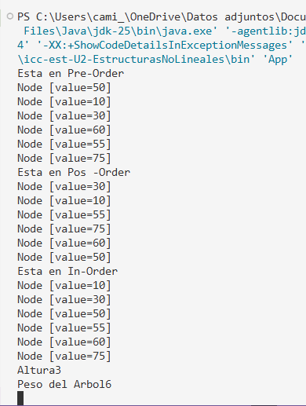

# Universidad Politécnica Salesiana

## Nombre: Paola Pintado
## Fecha: 17 /06/2026
## Practica:

## Actividad: la clase de hoy se creo una clase  que se llama IntTree - arbol binario de busqueda  y otra clase Node.

#  Descipción de la actividad:
 En el proyecto de hoy se creo un paquete "Sturctures","nodes" y "tress" en la cual dentro de ellos se crearon clases.
Dentro del paquete se creo una clase "IntTree" la cual implemeta un arblo de Búsqueda  para almacenar valores del tipo enteros(Integer). Su función principal es organizar los datos de forma jerárquica, permitiendo insertar elementos de manera ordenada mediante comparaciones entre nodos. 

Para ello se tuvo que crear una clase llamada Node  la cual representa un nodo dentro de una estructura de arbol binario. Cada uno almacena  un valor y mantiene referencias hacia sus nodos hijos izquierdo o derecho

En este repositorio , esta clase es utilizada por la clase Intree para construir el arbol de busqueda.

## Clase "Node"

La función de esta clase es almacenar el valor entero, mantener un referencia al hijo izquierdo y referencia al hijo derecho. Tmabien permite la conexión entre nodos  para formar la estructura  del árbol binario.

### Esta clase recibe tres atributos:

1. Value del tipo Integer: almacena el valor entero contenidoen el nodo.

2. Left(private Node left): que es una refencia del hijo izquierdo.

3. Right(private Node right): la cual es la referencia del hijo derecho.

### Contructor

El cual crea un nuevo nodo con el valor recibido e inicializa los tres atributos

### Métodos

Se crea metodos  para poder  obtner datos como (getValue, getLeft, getRight) y mostrar información usando el toString

## Clase IntTree

Esta clase se usó objetos del tipo "Nodede tipo Integer" para poder hacer el árbol binario.

## Atributos de la clase:

1. root del tipo Integer: (private Node < Integer > root) est eatributo representa la raíz del árbol binario

## Constructor

Se creó un constructor vacio"public IntTree()" que inicializa el árbol vacío. Sus valores iniciales:

this.root = null; (pues la raíz no tiene ningun nodo aún).

## Métodos 

En esta clase se  crearon métodos de acceso  como:

1. getRoot(); que ayuda a retornar el nood del raíz del árbol.

2. setRoot(Node root); permite asignar direcctamente un nodo como raíz.

3. setRoot(Integer value); Crea un nuevo nodo con el valor recibido y lo establece como la raíz del árbol.

## Insercion de Nodos

Se creó un metodo llamado "add(int value )"  que inserta un nuevo valor dentro del árbol, entonces, el metodo add primero crea el nodo con el valor
y valida o pregunta si la raiz tiene valor y si no tiene raiz es igual al retorno.

Actualiza la raíz del árbol con el resultado de la inseción.

========================================================================================================================================================================

## Fecha:19/06/2026
## Práctica: Hoy se trabajo en el mismo proyecto

## Actividad: Hoy se implemento una nueva clase "Persona" y "BinaryTree"

## Descripción:

En la clase BinaryTree se implentan un arbol binario de busqueda utilizando tipos henericos. Los elementos almacenados deben implementar la interfaz Comparable<T>  para poder compararse y ubicarse correctamente dentro del Arbol.

Esta clase permite:

- insertar nodos
- recorrer el arbol en preOrden, InOrden y PosOrden 
- tambien calcular la altura y el arbol.
- calcular el peso del arbol.

Imagen de salida de datos.
Con el arbol en Pre, Pos e InOrden, Altura y pero del Árbol:

---------------------------------------------------------------------------------------------------------------
## fecha : 22/06/ 2026
## Titulo de la practica: Ejercicios de Logica con estructuras no lineales: árboles 
## numero depractica: 4

## Descripcion:
 En la clase de hoy se realizaron  cuatro ejercicios que sirvieron pra mejorar la comprension de logica de programacion usando estructuras de datos no lineales

 - se aplico aboles binarios y arboles binarios de busqueda en la resolucion de problemas logicos

 - Tmbien se impleneto algoritmos de isnsercion, recorrido por niveles y calculo de profundidad

 - A la ves de organizo el cog=digo de carpetas, clase, y metodos

 ## Ejercicios

 Se realizaron tres ejercicios:

 1. Ejercicio 1: insertar valores de un arbol binario de busqueda

 2. Ejercicio 2: Invertir un arbol en listas enlazadas

 3. Ejercicio 3: Listar los niveles de arbol en lsitas enlazadas

 4. Calcular la profundidad maxima del arbol  

