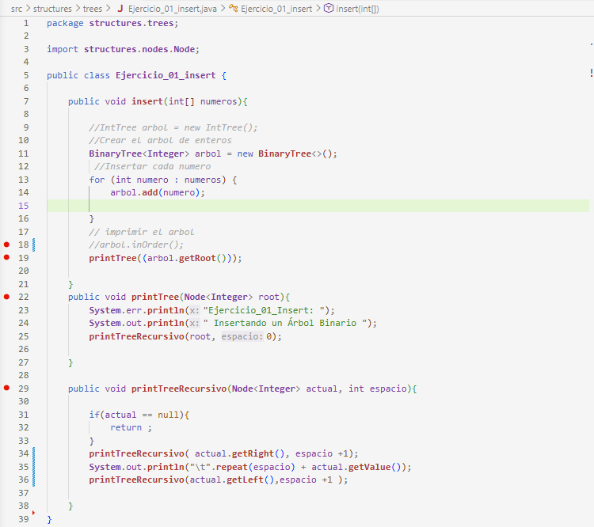
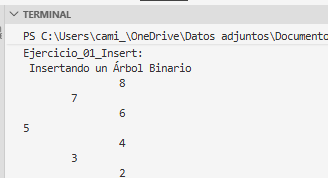
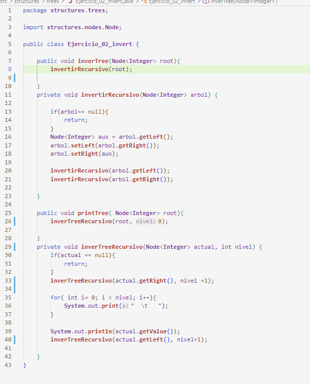
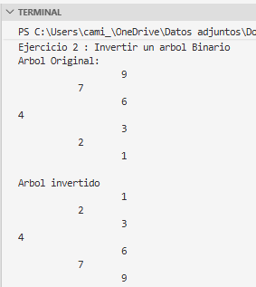
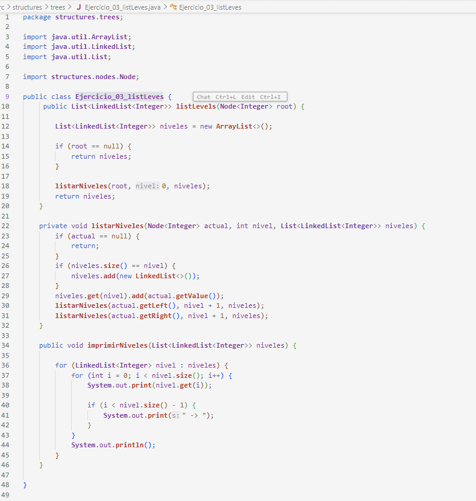
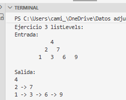
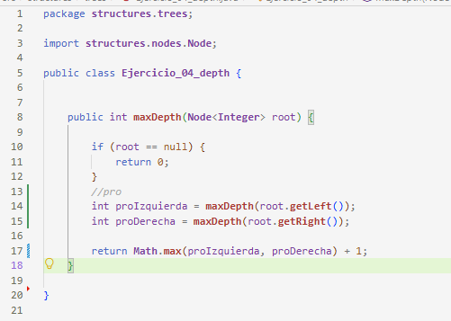
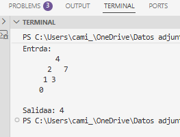
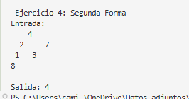

#  Universidad Politécnica Salesiana 
### Nombre del Estudiante: Paola Pintado

## Título de Prática: Ejercicios de logica con estructuras no lineales: árboles

## Descripción general:

En este proyecto se realizo cuatro ejemplos donde se usa la logica de un arbol binario en cada uno de los ejemplos implementando diferentes algoritmos. Se desarollo métodos para insertar nodos en un árbol binaro  de búsqueda, invertis la estructura del árbol, listar nodos por niveles y calcular la profundida máxima. -

## - Ejercicio_01: Inserción de un árbol Binario

Método: *insert*

El método *insert*  me permite agreagr valores enteros dentro de un árbol binario de búsqueda. Para poder usar este méetodo se usa un método recursivo  que ayuda a comparar el valor a insertar con el valor del nodo en el que esta en otras palabras en el nodo actual.

### Funcionamiento
En este ejercicio se creó un árbol binario con numeros almacenados en un arreglo y cada numero se fue insertando en la posicion que le corresponde den tro del arbol, para saber en que posicion se debia de insertar, pero  primero pregunta y despues se inserta:

ejemplo:
- Si el valor es menor que el nodo actual entonces se inserta en el súbarbol izquierdo caso contrario si el valor es mayor o igual, se insertaen el súbarbol derecho

Este proceso continua recursivamente hasta que pueda encontrar un posición vacia 

Captura de código ejercicio1

Captura salida de consola ejercicio1

## Ejercio 2: Invertir un árbol Binario

Método : *inverrTree*

En este ejercicio se realizo una inversion del arbol binario intercambiando los hikos izquierdo  y derecho de cada nodo.

ejemplo:

primero verifica si el nodo actual es nulo como en todo los caso para eso usa un caso base, depsues almacena temporalmenet el hijo ya sea derecho o derecho, luego intercambia los hijos izquierdo y derecho

Captura de Codigo ejercicio2:

Captura de salida de consola ejercicio 2

## Ejercicio 3: Listar nivees en Listas Enlazadas

Método: *listLevels*

En este ejercicio se tuvo que recorrer el árbol por niveles y se fueron guardando los nodos de cada nivel en una lista. Déspues se mostraron cada nivel

ejemplo: 

Primero recorre el árbol utilizando la reci=ursividad, un contador s emantiene en el nivel que le toca, si un nivel aún no existe en la lista principal, se crea una nueva lista enlazada y cada nodo se agrega a la lista que le toca a su nivel.

Captura de codigo de ejercicio3:

Captura de salida de consola ejercicio 3:

## Ejercicio 4: Calcula la profundidad máxima

Método *maxDepth*

En este ejercicio se calculo la profundida =d máxima del árbol binario. para ello primero se comparó la profundidad de la rama derecha y de la rama izquierda despues de comparar  se obtuvo el mayor

ejemplo: 

Se calcula recursivamente la profundidad del súbarbol derecho e izquierdo, despues  se relaciona la  profundidad mayor.

Captura de codigo del ejercicio 4:

Captura de salida: 

Captura de salida de consola de la segunda forma:

NOTA: En el ejercicio 4 se hizo de dos formas con una variacion de elementos

